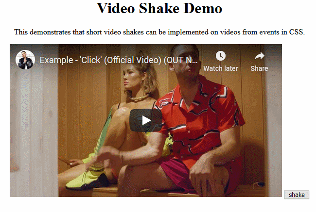

# DOM Jitter

> Library to add jitter effect to a video player.

[](https://www.npmjs.com/package/dom-jitter)
[](https://snyk.io/test/github/goatandsheep/video-shake)
[](https://codecov.io/gh/goatandsheep/video-shake)
[](https://github.com/xojs/xo)
[](https://www.npmjs.com/package/dom-jitter)




## Installation

```shell
npm i dom-jitter
```

## Node Example

Duration is the speed of the jitter and iterations is how long you want it to 

```javascript
import DomJitter from 'dom-jitter'

const jitterController = new DomJitter('.sample-video', 75) // uses CSS query selectors
jitterController.pulse(75, 2)

jitterController.start()
jitterController.stop()
```


Brought to you by [beatcaps.io](https://www.beatcaps.io)
